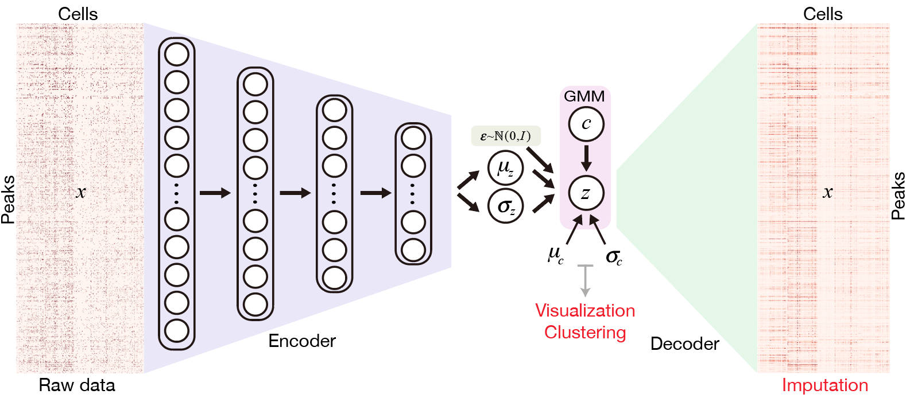
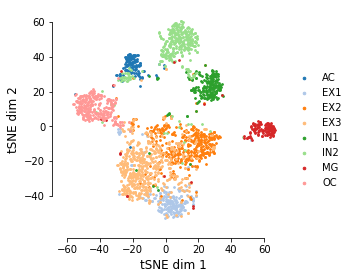

# Single-Cell ATAC-seq analysis via Latent feature Extraction

## Installation  

SCALE neural network is implemented in [Pytorch](https://pytorch.org/) framework.  
Running SCALE on CUDA is recommended if available.   

#### install via pip:

	pip install scale-atac
	
#### install from GitHub

	git clone git://github.com/jsxlei/SCALE.git
	cd SCALE
	python setup.py install
    
Installation only requieres a few minutes.

## Quick Start

Input scATAC-seq data should be one of: 
* **dense matrix**: **data.txt** / **data.txt.gz**
* **sparse matrix**: **data.mtx** / **data.mtx.gz**, with **peaks.txt** and **cell_id.txt**

#### Run SCALE without providing cluster number k: 

	SCALE.py -d [input_dir]

#### Run SCALE on dense matrix, e.g. [Forebrain](https://cloud.tsinghua.edu.cn/d/21975230039b46b8890e/) dataset (k=8):  

	SCALE.py -d Forebrain -k 8

	
#### Run SCALE on sparse matrix, e.g. [Mouse Atlas](https://cloud.tsinghua.edu.cn/d/cd5ea4ea93c04513966f/) dataset (k=30, ~80,000 cells):
	
	SCALE.py -d mouse_atlas -k 30 -x 4
	

#### Useful options  
* save results in a specific folder: [-o] or [--outdir] 
* filter rare peaks if the peaks quality if not good or too many: [-x]
* modify the initial learning rate, default is 0.002: [--lr]  
* change the batch size, default is 32: [--batch_size]
* change iterations by watching the convergence of loss, default is 30000: [-i] or [--max_iter]  
* change random seed for parameter initialization, default is 18: [--seed]
* binarize the imputation values: [--binary]
	
#### Note    
If come across the nan loss, 
* try another random seed
* filter peaks with harsh threshold like -x 4 or -x 6
* change the initial learning rate to 0.0002 
	
#### Results
Results will be saved in the output folder including:
* model.pt
* feature.txt
* cluster_assignments.txt
* imputed_data.txt
* tsne.txt
* tsne.pdf

#### Help
Look for more usage of SCALE

	SCALE.py --help 

Use functions in SCALE packages.

	import scale
	from scale import *
	from scale.plot import *
	from scale.utils import *
	
#### Running time

  
   

#### Tutorials

### Documentation

