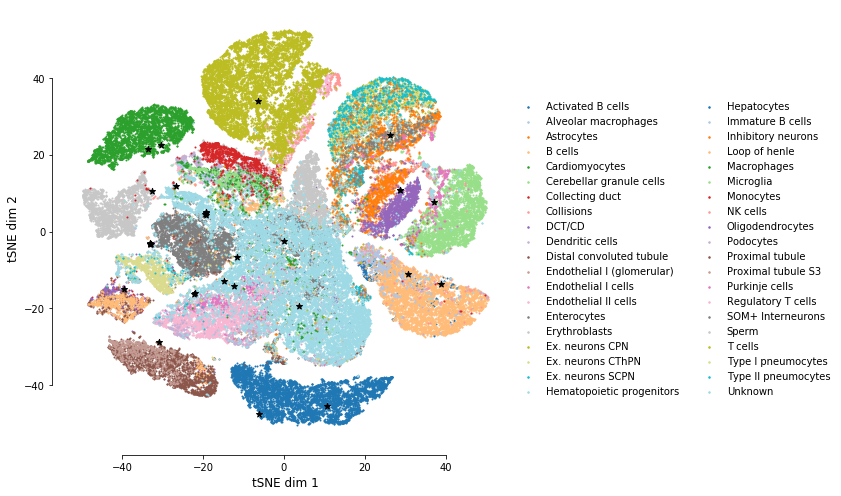
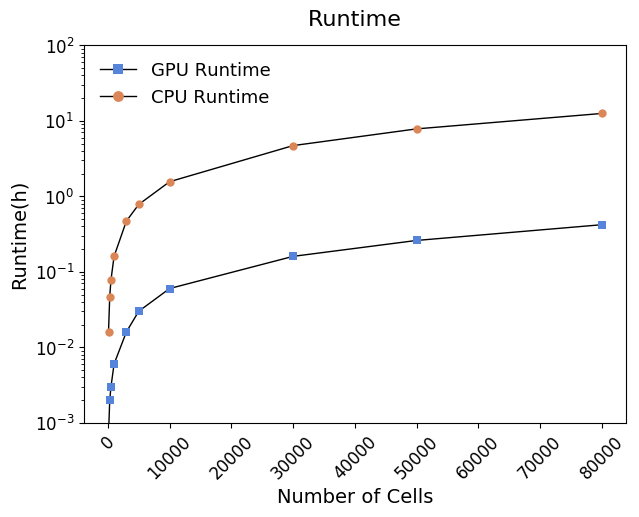
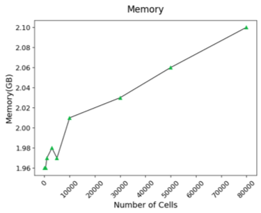

# SCALE
Single-Cell ATAC-seq analysis via Latent feature Extraction

### Installation  

SCALE neural network is implemented in [Pytorch](https://pytorch.org/) framework.  
Running SCALE on CUDA is recommended if available.   
	
Currently, SCALE requires Python 3.6+ and does not work with Python 2.7

#### Installation from GitHub

To clone the repository and install manually, run the following from a terminal:

    git clone git://github.com/jsxlei/SCALE.git
    cd SCALE
    pip install -r requirements.txt
    python setup.py install --user
    
Installation only requieres a few minutes.

### Usage

#### Quick Start

Run SCALE on count matrix file: 
* dense matrix: data.txt/data.txt.gz
* sparse matrix: data.mtx/data.mtx.gz, peaks.txt and cell_id.txt

Run SCALE on dense matrix, e.g. [Forebrain](https://cloud.tsinghua.edu.cn/d/21975230039b46b8890e/) dataset:  

	SCALE.py -d Forebrain -k 8
	
Run SCALE on sparse matrix, e.g. [Mouse Atlas](https://cloud.tsinghua.edu.cn/d/cd5ea4ea93c04513966f/) dataset:
	
	SCALE.py -d mouse_atlas -k 30 -x 4
	

cluster number k will be estimated if k is not provided: 

	SCALE.py -d [input_dir]

Useful options:  
* save results in a specific folder: [-o] or [--outdir] 
* filter rare peaks if the peaks quality if not good or too many: [-x]
* modify the initial learning rate, default is 0.002: [--lr]  
* change the batch size, default is 32: [--batch_size]
* change iterations by watching the convergence of loss, default is 30000: [-i] or [--max_iter]  
* change random seed for parameter initialization, default is 18: [--seed]
* binarize the imputation values: [--binary]
	
#### Note    
If come across the nan loss, 
* try another random seed
* filter peaks with harsh threshold like -x 4 or -x 6
* change the initial learning rate to 0.0002 
	
#### Results
Results will be saved in the output folder including:
* model.pt
* feature.txt
* cluster_assignments.txt
* imputed_data.txt
* tsne.txt
* tsne.pdf

#### Help
Look for more usage of SCALE

	SCALE.py --help 

Use functions in SCALE packages.

	import scale
	from scale import *
	from scale.plot import *
	from scale.utils import *
	
#### Running time

  
   

#### Tutorials
A demo on SCALE usage for single-cell ATAC-seq data can be found in this notebook: 
https://github.com/jsxlei/SCALE/tree/master/notebooks/tutorial.ipynb

### Documentation

* [Preprocessing](docs/preprocessing.md)
* [Model introduction](docs/model_introduction.md)
* [Inputs and Outputs](docs/inputs_and_outputs.md)
* [Feature embedding](docs/feature_embedding.md)
* [Cluster_assignments](docs/cluster_assignments.md)
* [Denoising and Imputation](docs/denoising_and_imputation.md)
* [Cell type specific elements](docs/cell_type_specific_elements.md)
