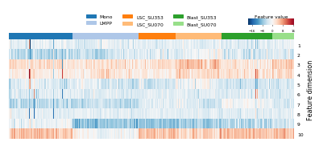
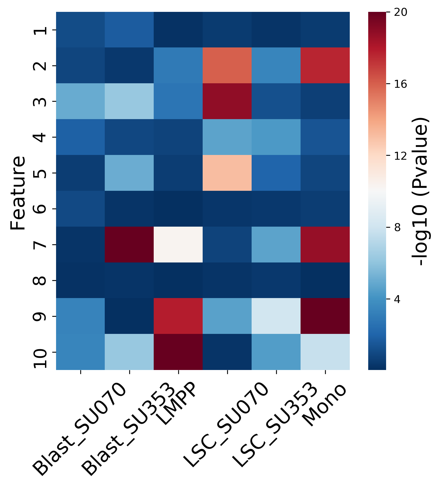
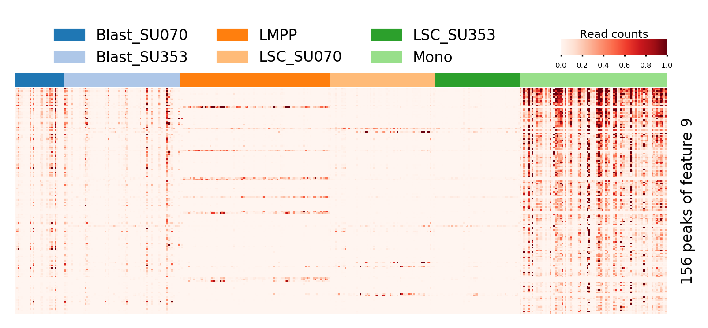
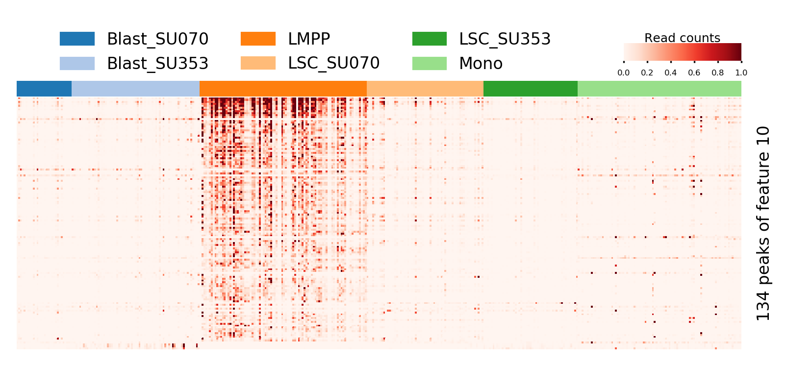
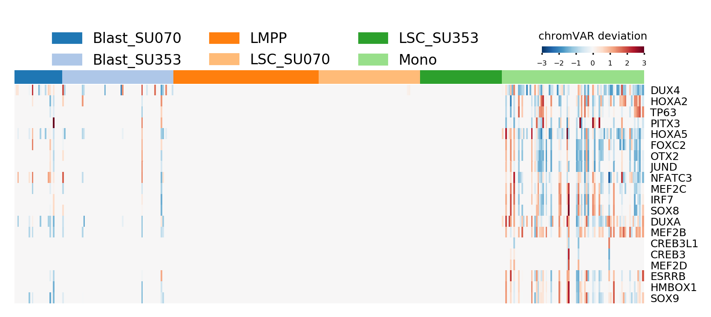
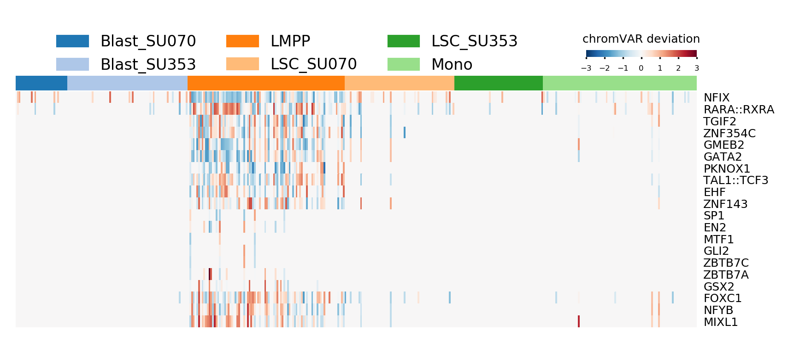

# Cell type specific elements

    from scale.plot import plot_heatmap
    from scale.utils import read_labels
    
    feature = pd.read_csv('../output/feature.txt', sep='\t', index_col=0, header=None)
    ref, classes = read_labels('../data/labels.txt') # or predicted cluster assignments
    imputed_data = pd.read_csv('../output/imputed_data.txt', sep='\t', index_col=0)
    
## feature heatmap
plot latent feature heatmap
 
    plot_heatmap(feature.T, ref, classes, 
                 figsize=(8, 3), cmap='RdBu_r', #vmax=8, vmin=-8,
                 ylabel='Feature components', yticklabels=np.arange(10)+1, 
                 cax_title='Feature value',
                 row_cluster=False, legend_font=6, 
                 col_cluster=False, center=0)
  
               
                 
## feature specifity
apply anova on the cell type specifity of feature against other cell types and plot the feature x cell type heatmap  
colorbar is -log10(Pvalues)

    feature_specifity(feature, ref, classes)

    
## cell type specific peaks
feature has 10 components(dimensions), each components has its most correlation peaks
    
    specific_peak_dir = '../output/specific_peaks/'
    for i in range(feature.shape[1])[-2:]: # show the represented peaks of last two components of feature
        peak_file = specific_peak_dir+'peak_index{}.txt'.format(i)
        peak_index = open(peak_file).read().split()
        peak_data = impute_data.loc[peak_index]
        plot_heatmap(peak_data, ref, classes,
                     cmap='Reds', 
                     figsize=(8,3), 
                     cax_title='Read counts', 
                     ylabel='{} peaks of feature {}'.format(len(peak_index), i+1),
                     vmax=1, vmin=0, legend_font=8,
                     col_cluster=False, row_cluster=False,
                     show_legend=True,
                     show_cax = True,
                     bbox_to_anchor=(0.4, 1.32),
                    )

## cell type enriched motifs
Apply [chromVAR](https://github.com/GreenleafLab/chromVAR) on specific peaks  
We offer an Rscript ["chromVAR"](../scripts/chromVAR) in the scripts folder which can be run directly by:

    e.g. chromVAR -i input_dir --peakfile peak_file -o output_dir
    ! chromVAR -i ../output/ --peakfile ../data/peaks.txt -o ../output/chromVAR
Input dir is output dir of SCALE including imputed_data.txt and specific_peaks dir
    
    
Plot deviations heatmap of chromVAR

    chromVAR_dir = '../output/chromVAR'
    for i in list(range(feature.shape[1]))[-2:]:
        dev = pd.read_csv(chromVAR_dir+'/dev{}'.format(i), index_col=0, sep='\t').fillna(0)
        var = pd.read_csv(chromVAR_dir+'/var{}'.format(i), index_col=0, sep='\t')

        figsize, N, bbox_to_anchor, position = (8,3), 20, (0.4, 1.3), (0.8, 0.78, .1, .016)
        index = var.sort_values(by='variability', ascending=False).index[:N]
        yticklabels = var.loc[index].name.values
        plot_heatmap(dev.loc[index], ref, classes, 
                     row_cluster=True, 
                     col_cluster=False, 
                     metric='Euclidean',
                     yticklabels=yticklabels, 
                     vmax=3, vmin=-3, 
                     figsize=figsize, 
                     legend_font=8,
                     show_legend=True,
                     show_cax=True,
                     bbox_to_anchor=bbox_to_anchor,
                     position=position,
                     tick_color='black',
                     cax_title='chromVAR deviation',
                     cmap='RdBu_r')
                     

                    
                 

                 
                 
