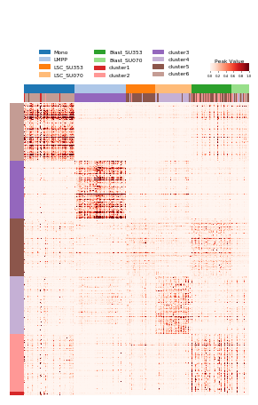

# Cell type specific elements

    from scale.plot import plot_heatmap
    from scale.utils import read_labels
    
    feature = pd.read_csv('../output/feature.txt', sep='\t', index_col=0, header=None)
    ref, classes, le = read_labels('../data/labels.txt', return_enc=True) # or predicted cluster assignments
    imputed_data = pd.read_csv('../output/imputed_data.txt', sep='\t', index_col=0)
    y = le.inverse_transform(ref)
    
    
## cell type specific peaks
feature has 10 components(dimensions), each components has its most correlation peaks

    score_mat = mat_specificity_score(imputed_data, pred)
    peak_index, peak_labels = cluster_specific(score_mat, classes=classes_, top=200);print(len(peak_index))
    row_labels = ['cluster'+str(c+1) for c in peak_labels]

        
plot specific peaks heatmap

    plot_heatmap(imputed_data.iloc[peak_index], y=y, classes=classes, y_pred=y_pred, row_labels=row_labels, 
                 ncol=3,cmap='Reds', vmax=1, row_cluster=False, legend_font=6, cax_title='Peak Value',
                 figsize=(6, 8), bbox_to_anchor=(0.4, 1.2), position=(0.8, 0.76, 0.1, 0.015))
                 

    
## cell type enriched motifs
Apply [chromVAR](https://github.com/GreenleafLab/chromVAR) or [Homer](http://homer.ucsd.edu/homer/motif/) on these specific peaks to find cell type enriched motifs.
