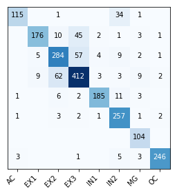

# Cluster assignments

Predicted cluster assignments result is saved in the cluster_assignments.txt file.  
Default cluster method is using K-Means on the latent features saved in the feature.txt file.  
You can use other clustering method with the latent features.

## Compare cluster assignments with ground truth labels.txt

    from sklearn.metrics import confusion_matrix
    from scale.plot import plot_confusion_matrix
    
    ref, classes = read_labels('../data/labels.txt') 
    assignments, assign_classes('../output/cluster_assginments.txt')
    
    cm = confusion_matrix(assignments, ref)
    plot_confusion_matrix(cm, classes, assign_classes, title='', normalize=False, figsize=(3,3), show_cbar=True)

