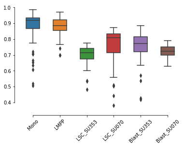
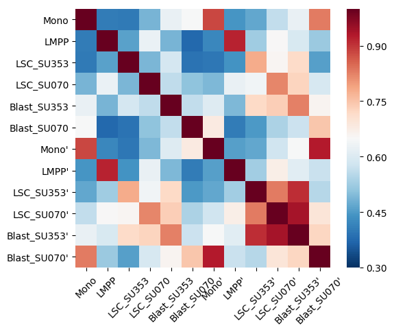

# Imputed data analysis

    from scale.utils import pairwise_pearson
    import numpy as np
    import seaborn as sns
    
    y = pd.read_csv('../data/labels.txt', index_col=0, header=None, sep='\t')[0] # ground truth
    imputed_data = pd.read_csv('../output/imputed_data.txt', sep='\t', index_col=0) # read imputed data
    raw_data = pd.read_csv('../data/data.txt', sep='\t', index_col=0) # read raw data
    classes = np.unique(y)

## Correlations of cells of imputed data with meta-cells of raw data

    cell_corr = []
    for c in classes:
        cells = np.where(y==c)[0]
        cell_corr.append(pairwise_pearson(imputed_data.iloc[:, cells].T, raw_data.iloc[:, cells].sum(1)))
    
    g = sns.boxplot(data=cell_corr, width=0.5)
    sns.despine(offset=10, trim=True)
    g.set_xticklabels(classes, rotation=45)
    

## Inter and intra correlation of imputed metacells

    raw_meta = []
    imputed_meta = []

    for c in classes:
        index = np.where(labels==c)[0]
        raw_meta.append(raw.iloc[:, index].mean(axis=1))
        imputed_meta.append(imputed.iloc[:, index].mean(axis=1)
       
    plt.figure(figsize=(5,5))
    classes_ = [ c+"'" for c in classes]
    ticklabels = np.concatenate([classes, classes_])
    
    g = sns.heatmap(np.corrcoef(raw_meta, imputed_meta), cmap='RdBu_r', 
                xticklabels=ticklabels, yticklabels=yticklabels, vmin=0.3, vmax=1, cbar=False)
    g.set_xticklabels(ticklabels, rotation=45)
    

