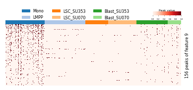
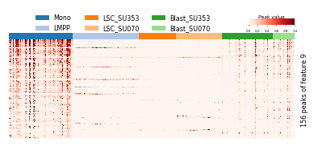
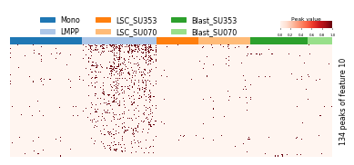
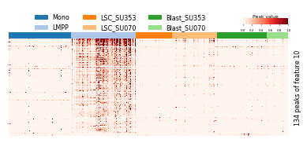

# Feature embedding

## Visualization of feature
Visualizate each cell as 2-dim scatter point of latent feature vis t-SNE colored by cluster assignments

    import pandas as pd
    from scale.plot import plot_embedding
    from scale.utils import get_decoder_weight, sort_by_mad
    
    feature_file = '../output/feature.txt'
    feature = pd.read_csv(feature_file, sep='\t', index_col=0, header=None) # read feature file
    
    assign_file = '../data/labels.txt' (ground truth) or '../output/cluster_assignments.txt' (predicted)
    y = pd.read_csv(assign_file, sep='\t', index_col=0, header=None)[1]
    classes = np.unique(y)
   
    legend_params = {'loc':'right', 'ncol':1, 'bbox_to_anchor':(0.4, 0.2), 'fontsize':8, 'markerscale':1.5}
    plot_embedding(feature, y, classes=classes, markersize=10, figsize=(4,4), legend_params=legend_params )
    
    

Plot heatmap of feature

    plot_heatmap(feature.T, y, classes=classes, 
             figsize=(8, 3), cmap='RdBu_r', #vmax=8, vmin=-8,
             ylabel='Feature dimension', yticklabels=np.arange(10)+1, 
             cax_title='Feature value',
             row_cluster=False, legend_font=6, 
             center=0)
             

Inteprete the feature as cell type specific peak patterns

    weight = get_decoder_weight('../output/model.pt')
    weight_index = sort_by_mad(raw_data, axis=1).index
    specific_peaks = peak_selection(weight, weight_index)

    for i, peak_index in enumerate(specific_peaks): # show the represented peaks of last two components of feature
    if i in [8, 9]:
        for data in [raw_data, imputed_data]:
            peak_data = data.loc[peak_index]
            plot_heatmap(peak_data, y, classes=classes,
                     cmap='Reds', 
                     figsize=(8,3), 
                     cax_title='Peak value', 
                     ylabel='{} peaks of feature {}'.format(len(peak_index), i+1),
                     vmax=1, vmin=0, legend_font=8,
                     row_cluster=False,
                     show_legend=True,
                     show_cax = True,
                     bbox_to_anchor=(0.4, 1.32),
                    )
                    

