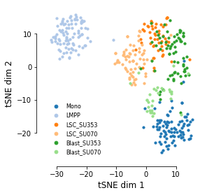

# Feature embedding

## Visualization of feature
Visualizate each cell as 2-dim scatter point of latent feature vis t-SNE colored by cluster assignments

    import pandas as pd
    from scale.plot import plot_embedding
    from utils.plot import read_labels
    
    feature_file = '../output/feature.txt'
    feature = pd.read_csv(feature_file, sep='\t', index_col=0, header=None) # read feature file
    
    assign_file = '../data/labels.txt' (ground truth) or '../output/cluster_assignments.txt' (predicted)
    ref, classes = read_labels(assign_file) # ref is encoded labels, classes are cell types
   
    plot_embedding(feature, ref, classes, markersize=10, figsize=(4,4))
    
    

