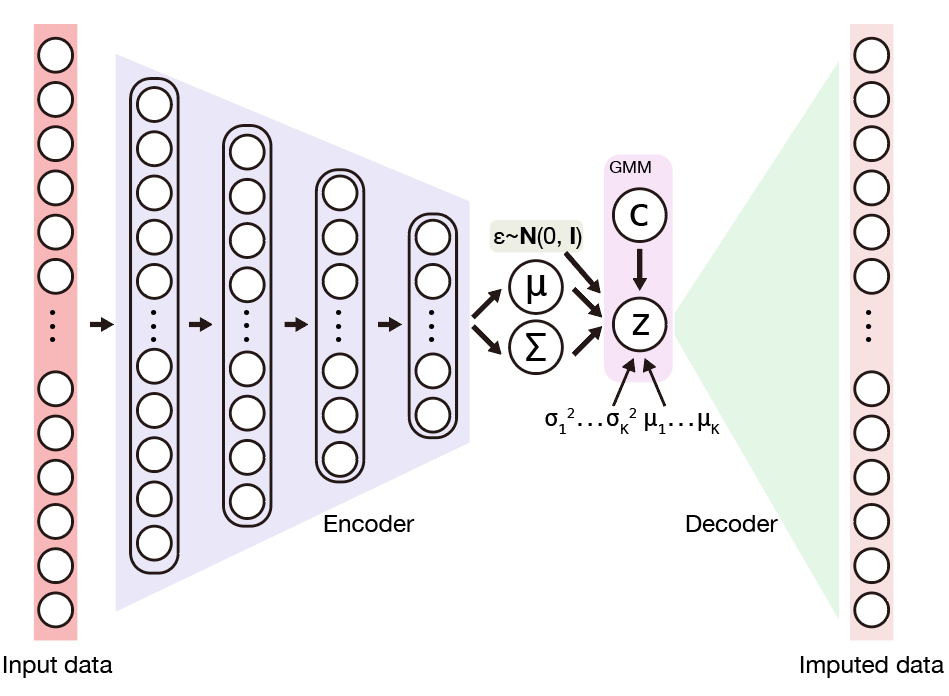

# Model introduction

## The evidence lower bound of SCALE
SCALE combines variational autoencoder (VAE) and Gaussian Mixture Model (GMM) to model the distribution of high dimensional sparse scATAC-seq data. 

joint probaility p(x,z,c) can be factorized into given x and c are independent conditioned on z:
>   

while:  
>   
>   
> <a href="https://www.codecogs.com/eqnedit.php?latex=p(x|z)&space;=&space;N(x|\mu&space;_{x},&space;\sigma_{x}^{2}I)" target="_blank"> https://latex.codecogs.com/gif.latex?p(x|z)&space;=&space;Ber(x|\mu&space;_{x})
                                                                                                                             
The log-likelihood of data:  
>   

can be transformed into maximizing evidence lower bound (ELBO):  
>   

which can be writen into a reconstruction term and regularization term:  
>   

The **reconstruction term** encourages imputed data similar to input data.  
The **regularization term** is Kullback-Leibeler divergence which regularizes the latent variable z to a GMM manifold.

## Model structure
SCALE is consisted by encoder and decoder.     
> **encoder**: a four-layer neural network (3200-1600-800-400) with ReLU activation function.    
> **decoder**: has no hidden layers, latent variable (feature) connected with output layer (peaks) with Sigmoid.   
**Initialize**: A GMM model is applied to initialize GMM parameters μ_c and σ_c of SCALE.   
**Optimizer**: Adam   
**weight decay**: 5e-4   
**Learning rate**: initializes at 0.002 with decaying 10% every 10 epochs until 0.0002.   
**Batch size**: 16    
**Epoch number**: 1000 for leukemia mixture and 300 for other data.  
